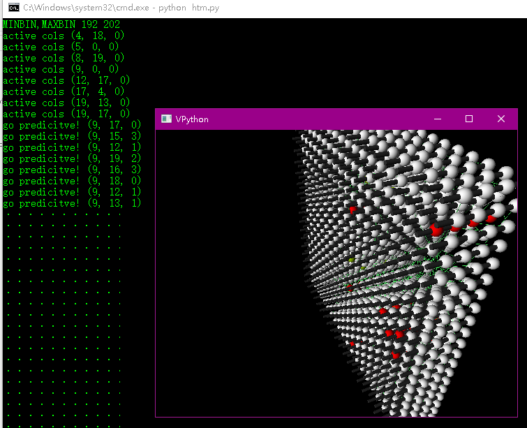

##  HTM-CLA algorithm with visualization

this program is a visualization demo of HTM algorithm, where you can see how it works, including how nerve signals flows through synapses, to a structure called "column" ,how cell get its "prediction" status ,etc.

HTM(hierarchical temporal memory) algorithm is an ANN-like algorithm presented by numenta Inc. this program is based on the implemention by leotrs (https://github.com/leotrs/numenta), but also got inspired by experiemental code written C++ (https://github.com/MichaelFerrier/HTMCLA ) , but also the official python version.

most of important idea could be referenced to official HTM-CLA white paper (http://numenta.org/cla-white-paper.htm) which released in 2010. 

some notes were taken to explicate features and behavor of conception in HTM algorithm like "synapse" "cell" "column" "region" .Most were refered in the white paper, but in debunching way

### REQUIREMENT
vpython  (a library named "visual" which is for drawing 3D graphic) (www.vpython.org )
this version fits for vpython 7.
### TODO
arrange code in  more simple way. (It were in beta-version, full of hacks, and need multithreading or parallel calculation programming)

add annotation to some import implemention of function in English.

more work on scatter data (as input) transition function .

get to some actual application. Like serial data forecast , or something ANN would do.

